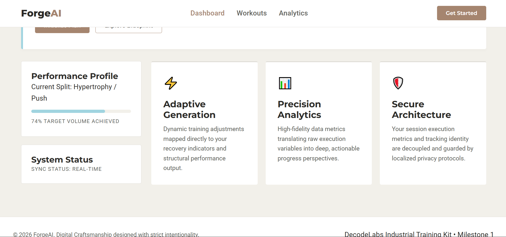

# ForgeAI - Smart Fitness Companion

**An intelligent, grounded approach to tracking your training execution and physical analytics seamlessly.**


## 🎯 Overview

ForgeAI is a modern web application designed to help fitness enthusiasts track their training progress with precision analytics and adaptive features. Built with clean, purposeful design principles, ForgeAI provides a comprehensive dashboard for monitoring your fitness journey.

---

## ✨ Key Features

### ⚡ Adaptive Generation
Dynamic training adjustments mapped directly to your recovery indicators and structural performance output.

### 📊 Precision Analytics
High-fidelity data metrics translating raw execution variables into deep, actionable progress perspectives.

### 🛡️ Secure Architecture
Your session execution metrics and tracking identity are decoupled and guarded by localized privacy protocols.

---

## 📁 Project Structure

```
├── index.html          # Main HTML structure
├── style.css           # Modern styling with design tokens
├── script.js           # Interactive functionality
├── README.md           # This file
└── images/
    ├── img-1.PNG       # Dashboard screenshot
    └── img-2.PNG       # Additional interface preview
```

---

## 🚀 Getting Started

### Prerequisites
- Any modern web browser (Chrome, Firefox, Safari, Edge)
- No build tools or dependencies required

### Installation

1. Clone or download the project files
2. Open `index.html` in your web browser
3. Click **"Initialize Plan"** to activate the execution mode

---

## 🛠️ Technologies Used

- **HTML5** - Semantic markup and modern structure
- **CSS3** - Custom properties (CSS Variables), Flexbox, responsive design
- **JavaScript (Vanilla)** - Frameworkless, lightweight interactivity
- **Google Fonts** - Montserrat & Roboto typography

---

## 🎨 Design System

The project uses a carefully curated design token system:

| Token | Color | Purpose |
|-------|-------|---------|
| Primary | #A5856F | Mocha Mousse - Grounded Stability |
| Accent | #A0D4E0 | Ethereal Blue - Trust & Clarity |
| Background | #F2F0EA | Moonlit Grey - Refinement |
| Surface | #FFFFFF | Clean cards and containers |

---

## 📱 Features Explained

### Dashboard Navigation
- **Dashboard**: Main performance overview
- **Workouts**: Training execution tracking
- **Analytics**: Deep performance insights

### Performance Profile
Track your current training split and monitor target volume achievement with visual progress indicators.

### System Status
Real-time synchronization status to ensure your data is always up-to-date.

---

## 🎬 Interactive Elements

- **Initialize Plan Button**: Activates execution mode and updates system status
- **Explore Blueprint Button**: For exploring training plans and methodologies
- **Navigation Links**: Quick access to different sections of the application

---

## 📸 Screenshots

| Feature | Screenshot |
|---------|-----------|
| Main Interface |  |
| Application Layout |  |

---

## 💡 How It Works

1. **Access the Dashboard**: Open the application to view your performance profile
2. **Initialize Your Plan**: Click "Initialize Plan" to begin tracking
3. **Monitor Progress**: Track your volume achievements and system status
4. **Explore Features**: Navigate between Dashboard, Workouts, and Analytics sections

---

## 🔒 Privacy & Security

ForgeAI prioritizes user privacy by:
- Using localized data storage protocols
- Decoupling session metrics from user identity
- Maintaining strict intentionality in data handling

---

## 📝 License

Part of the **DecodeLabs Industrial Training Kit • Milestone 1**

---

## 👨‍💻 Development Notes

This is a frameworkless application built with vanilla HTML, CSS, and JavaScript. The modular component architecture uses CSS custom properties for easy theming and maintenance.

### CSS Architecture
- Design tokens at root level
- Component-based styling methodology
- Responsive fluid typography using `clamp()`
- Mobile-first responsive design approach

---

## 🤝 Contributing

This project is part of an internship training program. For modifications or improvements, ensure all changes maintain the established design system and coding standards.

---

## 📞 Support

For issues or questions regarding ForgeAI, refer to the project documentation or contact the development team.

---

**Built with Digital Craftsmanship and Strict Intentionality** ✨