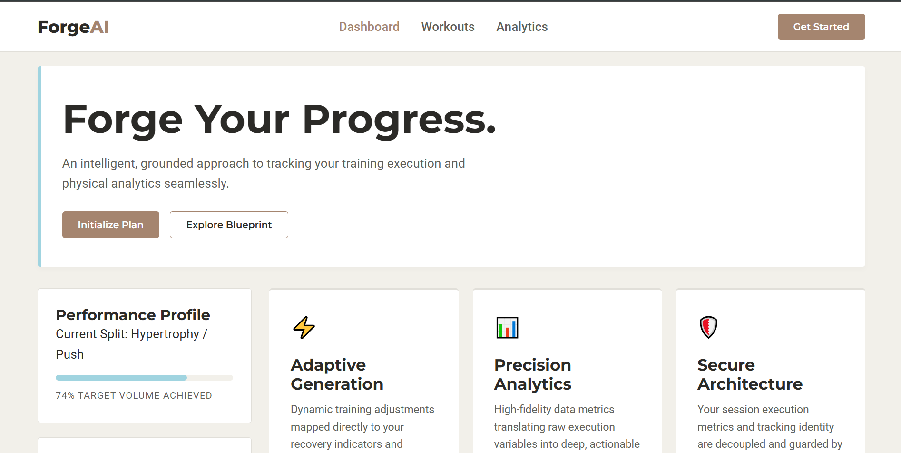

# ForgeAI - UI Interface

A responsive, mobile-first UI design for a fitness tracking dashboard interface.



## Overview

This is a UI/UX project focused on building a clean, modern interface for a fitness tracking application. The project demonstrates responsive web design principles with a mobile-first approach using vanilla HTML, CSS, and minimal JavaScript.

---

## Interface Sections

- **Navigation Header** - Sticky navigation with logo and menu links
- **Hero Section** - Landing area with call-to-action buttons
- **Dashboard Grid** - Side panel with performance profile and content cards
- **Footer** - Project information and metadata

---

## 📁 Project Structure

```
├── index.html          # Main HTML markup
├── style.css           # Styling with design tokens
├── script.js           # Basic interactivity
├── README.md           # This file
└── images/
    ├── img-1.PNG       # UI Screenshot
    └── img-2.PNG       # Additional UI Preview
```

---

## 🎨 Color Palette

The design uses a carefully selected color system:

| Token | Hex Code | Usage |
|-------|----------|-------|
| Primary | #A5856F | Mocha Mousse - Main branding color |
| Accent | #A0D4E0 | Ethereal Blue - Highlights & accents |
| Background | #F2F0EA | Moonlit Grey - Page background |
| Surface | #FFFFFF | Cards and container backgrounds |
| Text Dark | #2B2A27 | Primary text color |
| Text Muted | #615F5A | Secondary/muted text |
| Border | #E1DFD9 | Dividers and borders |

---

## 🚀 Quick Start

1. Open `index.html` in a web browser
2. No build tools or dependencies required
3. Fully responsive - test on mobile, tablet, and desktop viewports

---

## 💻 Technical Stack

- **HTML5** - Semantic markup
- **CSS3** - Flexbox, CSS custom properties (variables), responsive design
- **JavaScript** - Vanilla JS for minimal interactivity
- **Fonts** - Google Fonts (Montserrat, Roboto)

---

## 📱 Responsive Design

The UI follows a **mobile-first approach**:

- Fluid typography using CSS `clamp()` for scalable font sizes
- Flexible layout using Flexbox
- Mobile-hidden navigation links that can be expanded for larger screens
- Viewport-relative units for responsive sizing
- Touch-friendly button sizes and spacing

### Breakpoints & Scaling
- Base mobile design as the foundation
- Progressive enhancement for larger screens
- Responsive images in the `images/` folder

---

## 🎯 Project Details

**Course:** DecodeLabs Internship Training Kit - Task 1  
**Type:** UI/UX Interface Design  
**Scope:** Static HTML/CSS interface with basic JavaScript interactivity

---

## 📝 Notes

- This is a UI template/mockup with minimal functionality
- JavaScript handles basic button state changes and visual updates
- Design focuses on clean typography and color harmony
- No backend or database integration